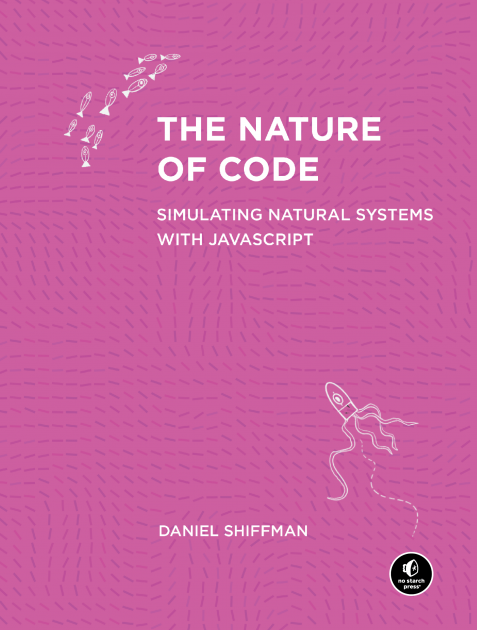

# About The Project

This directory contains all my coding examples, expirements, and learning exercises as i read through Daniel Shiffman's [*The Nature of Code*](https://natureofcode.com/). Most examples are based on the book, though some may deviate as i try to implement things my own way, or expirement a bit further. 

    

## Setup

P5.js can be easily setup either through a VS Code extension or by using the P5 web editor (requires an account). You can [follow the official P5 setup guide](https://p5js.org/tutorials/setting-up-your-environment/) to get started. 

For my purposes i will mainly use the VS Code extension as it will allow me to track changes with git/github, and work offline. In addition, I'll also be porting some examples to the P5 web editor so that i can share live demos that you can quickly view in your browser.

## Demos
